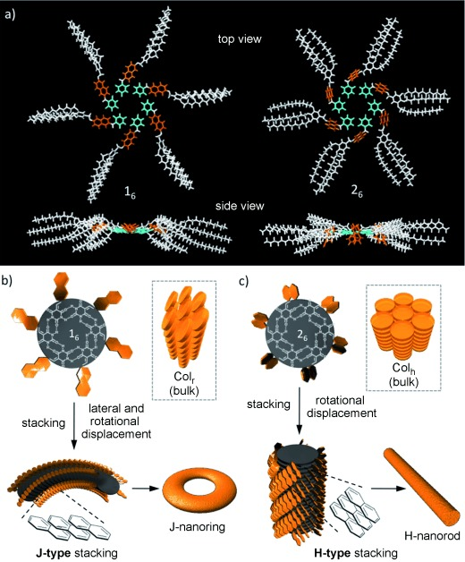

Light RoseはBarbituric Acid（バルビツール酸）からなる超分子ポリマーのAFMを解析のためにまとめたリポジトリです。
ただし、Github上では実験データそのものは公開しません。

# 分子の会合機構
Barbituric Acidは水素結合を介してRosette(ロゼット, ロゼッタではありません)と呼ばれる環状の会合体を形成します。Rosetteはさらにスタックして超分子ポリマーを形成します。ロゼットの平面性の違いにより、湾曲構造や直線構造をとることが知られています。
[Naphの立体障害が湾曲に起因する例](https://onlinelibrary.wiley.com/doi/10.1002/anie.201201436)

# データ管理について
各分子はサンプル名（分子の名前）を主キーとするように管理します。
サンプル名は、Bar側から表現して、
上論文の1ならBar26NaphOCH2TDP、2ならBar14NaphOCH12TDPとします。

# リポジトリの内容
- 'raw_data': AFMの測定時のファイル名のままのデータを格納しています。
- 'renamed_data': 測定条件やサンプル情報を下記のフォーマットでリネームしたデータを格納しています。
  - フォーマット: [サンプル名]_[濃度]_[溶媒]_[調整条件1]_[調整条件2]...
    - 例: LightRose_0.1uM_MCH_NormalCooling
- 'analysis_scripts': AFMデータの解析に使用したスクリプトを格納しています。

- 'renaming_info.xlsx': リネームの対応表を格納しています。

- 'chemical_structures': サンプル名に対応する化学構造式の情報をcdxml形式で格納しています。

